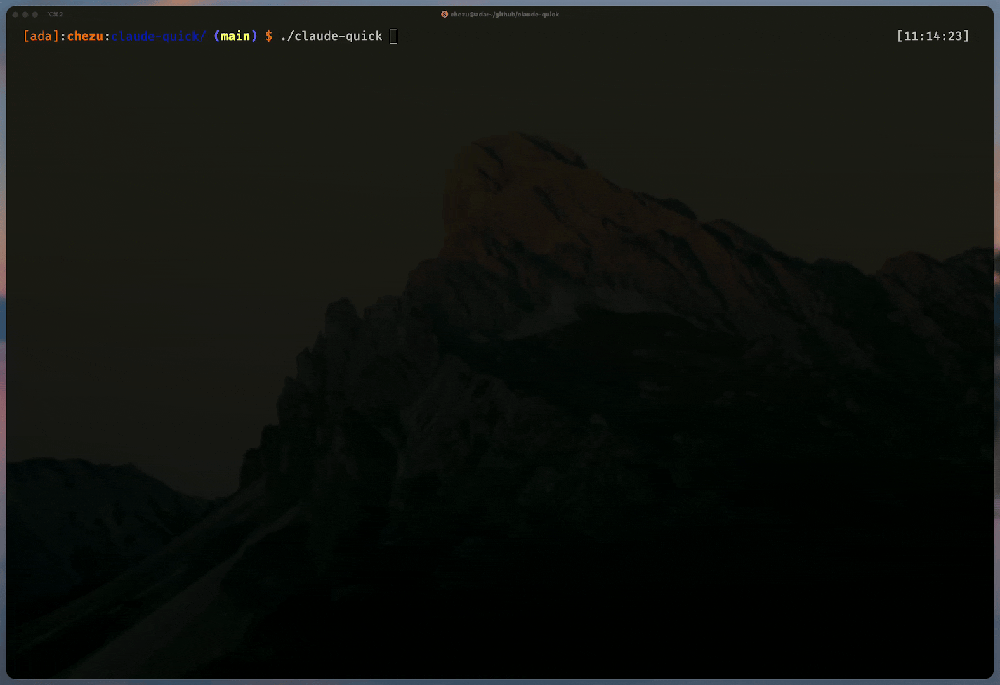

# Claude Quick


A terminal UI for managing tmux sessions across your devcontainers.

## Requirements

- Go 1.25+
- Docker
- [devcontainer CLI](https://github.com/devcontainers/cli) (`npm install -g @devcontainers/cli`)
- tmux inside your devcontainers

## Installation

```bash
go install github.com/christophergyman/claude-quick@latest
```

Or build from source:
```bash
git clone https://github.com/christophergyman/claude-quick.git
cd claude-quick
go build -o claude-quick .
```

Or use the build script (runs tests, builds, symlinks to ~/.local/bin):
```bash
./build.sh
```

Then run:
```bash
claude-quick
```

## Testing

Run the test suite:
```bash
go test ./...
```

Tests cover: auth, config, devcontainer discovery, TUI helpers, and utilities.

## Usage

1. Launch `claude-quick` to see all discovered devcontainers
2. Select a container (starts it if stopped)
3. Choose or create a tmux session
4. Detach with `Ctrl+b d` to return to the dashboard

### Keybindings

| Key | Action |
|-----|--------|
| `j`/`k` or `↑`/`↓` | Navigate |
| `Enter` | Select / Connect |
| `x` | Stop container or session |
| `r` | Restart |
| `R` | Refresh status |
| `n` | New worktree |
| `d` | Delete worktree |
| `?` | Show config |
| `q` / `Esc` | Back / Quit |

## Git Worktrees

Claude Quick treats each git worktree as a separate devcontainer instance, allowing you to work on multiple branches simultaneously in isolated containers.

- **Create a worktree**: Press `n` on any git repository to create a new worktree from a branch
- **Delete a worktree**: Press `d` to remove a worktree (stops container first if running)
- **View**: Worktrees appear as `project [branch-name]` in the dashboard

Constraints:
- Can only create worktrees on git repositories
- Cannot delete the main worktree (only branches)

## Configuration

Config file location (in priority order):
1. **Recommended**: `claude-quick.yaml` next to the executable (for `build.sh` installs, this is the repo root)
2. **Legacy** (deprecated): `~/.config/claude-quick/config.yaml`

```yaml
search_paths:
  - ~/projects
  - ~/work
max_depth: 3
default_session_name: main
```

### Migrating from Legacy Location

If you have an existing config at `~/.config/claude-quick/config.yaml`:

```bash
cp ~/.config/claude-quick/config.yaml /path/to/claude-quick/claude-quick.yaml
```

The legacy location will still work but shows a deprecation warning.

See [`claude-quick.yaml.example`](claude-quick.yaml.example) for all options.

## Authentication

Pipe authentication credentials (API keys, tokens) into your devcontainers automatically.

### Setup

Add an `auth` section to your config:

```yaml
auth:
  credentials:
    # Read from a file
    - name: ANTHROPIC_API_KEY
      source: file
      value: ~/.claude/.credentials

    # Read from environment variable
    - name: GITHUB_TOKEN
      source: env
      value: GITHUB_TOKEN

    # Run a command (e.g., password manager)
    - name: OPENAI_API_KEY
      source: command
      value: "op read op://Private/OpenAI/credential"
```

### Source Types

| Type | Description | Value |
|------|-------------|-------|
| `file` | Read credential from a file | Path to file (supports `~`) |
| `env` | Read from host environment variable | Name of the env var |
| `command` | Run a command and use output | Shell command to execute |

### Project-Specific Overrides

Override credentials for specific projects by directory name:

```yaml
auth:
  credentials:
    - name: ANTHROPIC_API_KEY
      source: file
      value: ~/.claude/default-key

  projects:
    my-work-project:
      credentials:
        - name: ANTHROPIC_API_KEY
          source: file
          value: ~/.claude/work-key
```

### How It Works

1. On container start, credentials are resolved and written to `.claude-quick-auth` in the project directory
2. When you create a tmux session, environment variables are injected via `tmux setenv`
3. All windows/panes in the session inherit these credentials
4. On container stop, the credential file is automatically cleaned up

The `.claude-quick-auth` file is added to `.gitignore` to prevent accidental commits.

## Nerd Font Support

For proper Unicode rendering in devcontainers (e.g., Claude CLI), add to your `devcontainer.json`:

```json
{
  "containerEnv": {
    "TERM": "xterm-256color",
    "LANG": "en_US.UTF-8"
  }
}
```

## License

MIT
